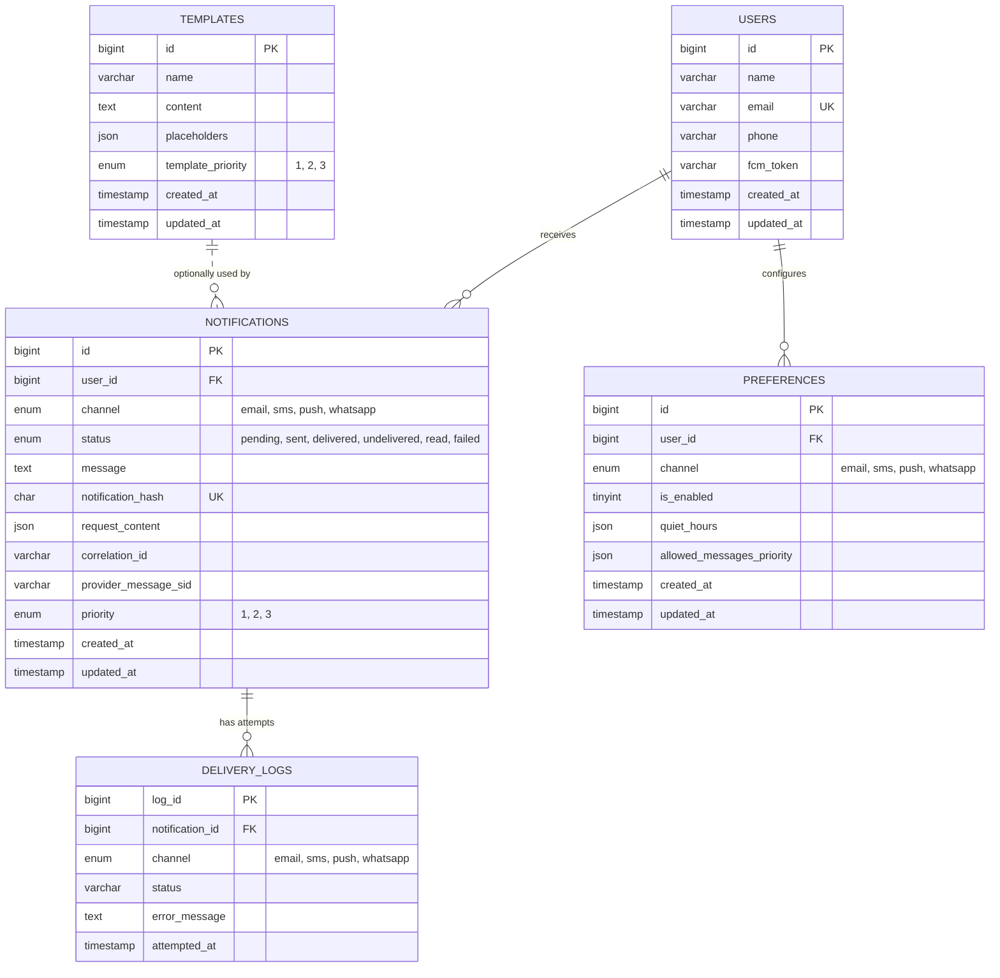

# Notification Engine

A multi-channel notification delivery system built with **Spring Boot**, **Apache Kafka**, and **Debezium/Kafka Connect (CDC)**, capable of sending notifications over **Email, SMS, WhatsApp, and Push** — with priority-based routing, per-user preferences (including quiet hours), template-driven messaging, idempotency guarantees, automatic retries with dead-letter handling, real delivery-status tracking via vendor webhooks (WhatsApp/SMS/Email), and full observability (metrics, logs, and distributed tracing).

This isn't a single monolith — it's six independently deployable Spring Boot services plus a Kafka Connect pipeline, together forming an event-driven system that closely mirrors how notification platforms are built in production (think: what powers OTPs, transactional alerts, and marketing pings at scale).

---

## Table of Contents
- [Why This Project Exists](#why-this-project-exists)
- [Tech Stack](#tech-stack)
- [System Architecture](#system-architecture)
- [How a Notification Actually Travels](#how-a-notification-actually-travels)
- [The Outbox Pattern: Why Two Kafka Producers Instead of One](#the-outbox-pattern-why-two-kafka-producers-instead-of-one)
- [Kafka Topic Design](#kafka-topic-design)
- [Delivery Status Tracking](#delivery-status-tracking)
- [Reliability & Fault Tolerance](#reliability--fault-tolerance)
- [Secrets & Configuration Management](#secrets--configuration-management)
- [Observability](#observability)
- [Database Design (ERD)](#database-design-erd)
- [API Surface](#api-surface)
- [Running Locally](#running-locally)
- [Testing Delivery-Status Webhooks Locally](#testing-delivery-status-webhooks-locally)
- [Known Limitations & Honest Caveats](#known-limitations--honest-caveats)
- [Proof of Delivery — All 4 Channels](#proof-of-delivery--all-4-channels)

---

## Why This Project Exists

Sending a notification sounds simple — until you need to send **millions** of them, across **multiple channels**, without spamming users who've opted out, without duplicating messages on retry, without one slow vendor (say, an email provider having an outage) blocking urgent OTP SMS's from going out, and — critically — without lying to yourself about whether a message actually arrived.

This project solves that by treating notification delivery as an **asynchronous, priority-aware, per-channel pipeline** with **verified delivery outcomes**, instead of a single "send now, assume it worked" API call — which is the architecture real-world systems like AWS SNS, Twilio Notify, or an internal fintech alerting stack actually use.

---

## Tech Stack

| Layer | Technology |
|---|---|
| Language / Framework | Java 17, Spring Boot 3.4 |
| Messaging Backbone | Apache Kafka (KRaft mode — no ZooKeeper), Kafka UI (kafbat) for monitoring topics/consumer groups |
| Change Data Capture / Outbox | **Kafka Connect + Debezium MySQL connector**, with a custom outbox `EventRouter` transform and a custom priority-aware partitioner plugin |
| Persistence | MySQL 8 (via Spring Data JPA / Hibernate), with binlog (ROW format) enabled for CDC |
| Secrets Management | **HashiCorp Vault** (dev-mode server + auto-seeding init container), with a fail-fast startup check per service |
| Caching | Redis (template-priority lookup + user/preference cache) |
| Resilience | Resilience4j (Circuit Breaker + Rate Limiter), Spring Kafka `@RetryableTopic` + DLT |
| Observability | Spring Boot Actuator + Micrometer (`/actuator/prometheus`), Prometheus (metrics scraping), Grafana (dashboards), Loki (centralized log aggregation via `loki-logback-appender`), Kafka Exporter (broker/topic metrics), correlation-ID based distributed tracing propagated through Kafka headers |
| Email Provider | SendGrid — send API + signed Event Webhook for delivery status |
| SMS / WhatsApp Provider | Twilio (WhatsApp Business API — media capped at one attachment *per Twilio message*; multiple attachments fan out into multiple sequential messages) — send API + signed status-callback webhook for both channels |
| Push Provider | Firebase Cloud Messaging (`firebase-admin`) — send API only; FCM has no server-to-server delivery webhook (see [Known Limitations](#known-limitations--honest-caveats)) |
| Containerization | Docker Compose — MySQL, Redis, Kafka broker, Kafka Connect, Kafka UI, Prometheus, Grafana, Loki, Kafka Exporter, Vault, and their init/bootstrap containers |
| API Testing | Postman collection included in repo (`infra/postman/`, v2.1) |

---

## System Architecture

The system is composed of **6 deployable services**, each with a single, well-defined responsibility, plus a Kafka Connect pipeline that does part of the "plumbing" that used to be application code:

1. **`notificationservice`** — the public-facing API gateway. Accepts send requests, validates them, assigns a priority, and hands off to Kafka. Also owns Users, Templates, and Preferences CRUD, and — as of the latest changes — **three delivery-status webhook endpoints** that receive real outcome data back from Twilio and SendGrid. A `CorrelationIdFilter` stamps every inbound request with a correlation ID (via MDC) so its lifecycle can be traced end-to-end across every downstream service.
2. **`NotificationProcessor`** — the brain. Consumes priority-tagged requests, resolves templates, checks user preferences/quiet-hours, de-duplicates, and persists the result to the `notifications` table. This service is **deployed multiple times** — once per priority level (`NOTIFICATION_PRIORITY=1|2|3`) — so a flood of low-priority marketing messages can never starve high-priority OTPs of processing capacity. **It no longer publishes to Kafka itself** — see [The Outbox Pattern](#the-outbox-pattern-why-two-kafka-producers-instead-of-one) below for why.
3. **`EmailConsumer`**, **`SMSConsumer`**, **`WhatsappConsumer`**, **`PushNConsumer`** — four independent microservices, one per channel, each consuming from its own Kafka topic and calling the relevant third-party vendor API (SendGrid / Twilio / Twilio WhatsApp / FCM), wrapped in a circuit breaker + rate limiter, with dead-letter handling on exhausted retries.

Sitting alongside these, **Kafka Connect** runs a Debezium MySQL connector that tails the database's binlog and turns qualifying `notifications` row-inserts directly into messages on the per-channel Kafka topics — no application code in the critical path does that fan-out anymore.

The correlation ID generated at the gateway is propagated as a Kafka message header (and, for the CDC hop, as a Debezium-routed header) through every stage of the pipeline, so a single notification's journey — from the initial API call, through priority routing, DB persistence, CDC fan-out, and final vendor delivery — can be reconstructed from logs across all six services.

### Basic Overview Diagram


### Advanced Overview Diagram


> **Note:** these diagrams predate the outbox/CDC migration and still show `NotificationProcessor` producing directly to channel topics. Conceptually the *shape* is the same (priority hop → channel hop → vendor), but the *mechanism* of the second hop has changed — see the next section. Diagrams are kept for high-level orientation; the text below is the source of truth for exact behavior.

**Why this shape?**
- **Two Kafka hops instead of one** (priority topics → channel topics) decouples *"how urgent is this?"* from *"which channel does it go on?"* — a processor doesn't need to know anything about SendGrid vs Twilio, and a channel consumer doesn't need to know anything about priority queuing.
- **Independent scaling.** If WhatsApp delivery is slow today, you scale up `WhatsappConsumer` alone — Email and SMS are untouched.
- **Independent failure domains.** SendGrid having an outage doesn't touch SMS or Push. Resilience4j's circuit breaker trips per-vendor, not globally.
- **No dual-write problem.** By moving the second Kafka hop into CDC, a `NotificationProcessor` instance only ever has one durable side effect per notification (the DB write) instead of two (DB write *and* Kafka publish) that could fall out of sync if the process crashed between them.

---

## How a Notification Actually Travels

1. A client calls `POST /api/send-notification` on `notificationservice` with a recipient, one or more channels, and either a raw message or a template name + placeholders.
2. The gateway validates the payload, and if no explicit priority was given, looks up the **template's priority** (checking Redis first, falling back to MySQL and populating the cache) — so, for example, an OTP template can be pre-configured as priority `1` (urgent) while a "trending nearby" promo is priority `3` (low).
3. The full request is serialized and pushed onto `priority-1`, `priority-2`, or `priority-3` on Kafka (one Kafka message per recipient), carrying the request's correlation ID as a header. The API returns `202 Accepted` immediately — the caller doesn't wait for actual delivery.
4. A `NotificationProcessor` instance dedicated to that priority level picks it up. It:
   - Resolves the template into a final message (if templated),
   - Looks up the user's **preferences** — is this channel enabled for them? Are we inside their configured **quiet hours**? Is this message's priority in their `allowed_messages_priority` list?
   - Computes a **content hash** and attempts to persist a `notifications` row — the `(user_id, channel, notification_hash)` unique constraint in MySQL is what actually enforces idempotency; a retried/duplicate request fails to insert and is safely dropped.
   - If the message is allowed, the row is written **with `request_content` populated** (the resolved per-channel payload as JSON) and a `delivery_logs` row is written marking it `pending`. If the message is blocked (opted out / quiet hours / priority not allowed), the row is still written for audit purposes, but with `request_content` left `NULL` — which matters a lot for the next step.
5. **Debezium**, watching the MySQL binlog, picks up the new row. Its outbox `EventRouter` transform is configured to only act on rows where `request_content IS NOT NULL` — so preference-blocked notifications never produce a Kafka message at all. For every row that qualifies, it publishes a message onto `<channel>-topic` (`email-topic`, `sms-topic`, `whatsapp-topic`, or `push-n-topic` — routed by the `channel` column, with a small fix-up rule mapping `push` → `push-n-topic` to match this repo's naming), keyed by priority, with the correlation ID carried over as a Kafka header and a **custom partitioner plugin** placing it into the correct priority-weighted partition range within that topic.
6. The relevant channel consumer (e.g. `EmailConsumer`) picks the message off its topic, calls the vendor SDK through a Resilience4j-wrapped client, and records the outcome honestly: a 2xx from the vendor means **"accepted for delivery,"** not "delivered" — the notification status is set to `sent`, and (for WhatsApp, SMS, and Email) the vendor's own message ID is stored so a later webhook can correlate back to it. For WhatsApp specifically, if a request includes multiple media attachments, `WhatsAppSender` fans them out into multiple sequential Twilio messages (Twilio's WhatsApp API allows only one attachment per message).
7. If the vendor call keeps failing, Spring Kafka's retry topic mechanism retries with exponential backoff before routing the message to a **dead-letter topic**, where the notification is finally marked `failed`.
8. **Separately and asynchronously**, for WhatsApp, SMS, and Email, the vendor's own delivery-status webhook (see [Delivery Status Tracking](#delivery-status-tracking)) eventually reports back what actually happened — `delivered`, `read`, `undelivered`, or a final `failed` — and `notificationservice` updates the same `notifications` row again. Push notifications have no equivalent step; `sent` is the final status FCM's API lets this codebase know.

---

## The Outbox Pattern: Why Two Kafka Producers Instead of One

This is the single biggest architectural change since the last major README revision, so it gets its own section.

**The problem it solves:** in the original design, `NotificationProcessor` did two separate things after deciding a notification was allowed — `INSERT` a row into MySQL, *and* call `kafkaTemplate.send()` to the right channel topic. Those are two independent operations against two independent systems. If the process crashed (or the pod was killed, or the network blipped) between the two, you'd get one of two bad outcomes: a `notifications` row with no corresponding Kafka message (the notification silently never gets sent), or — worse — a Kafka message with no corresponding DB row (a notification gets sent with no audit trail). This is the classic **dual-write problem**, and there's no way to fully solve it with two independent client libraries talking to two independent systems, short of a distributed transaction (which nobody actually wants to run in production).

**The fix:** make the database the *only* thing `NotificationProcessor` writes to, and derive the Kafka message from that write using **Change Data Capture (CDC)** — specifically, a Debezium MySQL connector, running inside Kafka Connect, that tails the binlog. MySQL's binlog write and the original `INSERT` are part of the same atomic operation from the database's perspective, so there's no window where one happens without the other. The `notifications` table is effectively doubling as a **transactional outbox table**.

Concretely, this is wired up as:
- **`infra/docker-compose.yml`** starts MySQL with `--log-bin=mysql-bin --binlog-format=ROW --server-id=1 --binlog-row-image=FULL` — CDC requires row-based binlog with full row images so Debezium can see the complete `after` state of each insert.
- **`infra/kafka-connect/outbox-connector.json`** is the Debezium connector config: it watches only `notification_engine.notifications`, filters to rows where `request_content` is populated (`transforms.filterPopulated`), and routes each qualifying row through Debezium's built-in `outbox.EventRouter` transform — `channel` becomes the topic-name suffix, `priority` becomes the Kafka message key, `request_content` becomes the message body, and `correlation_id` gets attached as a `correlationId` header.
- **`infra/kafka-connect/priority-partitioner/`** is a small custom Kafka Connect plugin (built from source in `infra/kafka-connect/Dockerfile`) containing two classes:
   - `PrefixKey` — a lightweight Single Message Transform that turns the raw priority key (`1`, `2`, `3`) into `priority-1`, `priority-2`, `priority-3`, matching the format the partitioner expects.
   - `PriorityPartitioner` — a custom Kafka `Partitioner` that reserves a weighted range of each channel topic's partitions per priority (roughly 50% / 30% / 20% for priority 1/2/3), so that even *within* `email-topic`, urgent traffic isn't sitting behind a backlog of low-priority partitions waiting to be consumed. This **replaces** the old in-application `CustomPartitioner` class that used to live in `NotificationProcessor` — that class is still present in the codebase but is no longer wired into any active Kafka producer, since `NotificationProcessor` doesn't produce to Kafka anymore. It's effectively vestigial at this point.
- **`connect-init`** (a one-shot container in `infra/docker-compose.yml`) registers this connector automatically against the Kafka Connect REST API on first `docker-compose up`, so there's no manual registration step for a fresh environment. **`infra/scripts/register-outbox-connector.sh`** is kept in the repo purely as a convenience for re-registering/updating the connector's config later, mid-session, without tearing down the whole stack.

**What this means in practice:** the *first* Kafka hop (gateway → priority topics) is still a normal, direct `KafkaTemplate` produce from `notificationservice` — there's no dual-write risk there because the gateway has no DB write to keep in sync with it. It's specifically the *second* hop (priority-topic-processing → channel topics) that moved to CDC, because that's the hop with a DB write sitting right next to it.

---

## Kafka Topic Design

| Topic | Producer | Consumer | Purpose |
|---|---|---|---|
| `priority-1` / `priority-2` / `priority-3` | `notificationservice` (direct Kafka produce) | `NotificationProcessor` (one deployment per priority) | Route requests by urgency so low-priority traffic can't delay high-priority traffic |
| `email-topic`, `sms-topic`, `whatsapp-topic`, `push-n-topic` | **Kafka Connect / Debezium outbox connector**, reading the `notifications` table | corresponding `*Consumer` service | Fan-out by delivery channel; each channel scales and fails independently. Partition placement within each topic is priority-weighted by the custom `PriorityPartitioner` Connect plugin. |
| `<topic>-retry-N` / DLT | Spring Kafka retry mechanism | Same consumer, then a `@DltHandler` | Automatic backoff retries (4 attempts, exponential backoff, multiplier 3.0) before permanently marking a notification `failed`. `FatalVendorException` (permanent vendor rejections — bad phone number, invalid token, etc.) skips retries entirely and goes straight to the DLT. |
| `connect-configs` / `connect-offsets` / `connect-status` | Kafka Connect internal | Kafka Connect internal | Connect's own cluster coordination topics — not application data. |
| `schema-changes.notification-engine` | Debezium | Debezium | Internal schema history topic Debezium needs to track DDL changes on the watched table. |


Every message on every application topic carries the originating correlation ID as a Kafka header, which each consumer restores into its own MDC context for traceable logging.

---

## Delivery Status Tracking

This is the other major addition since the last README revision: three of the four channels now track **real, vendor-confirmed delivery outcomes**, not just "we handed it to the vendor and assumed it worked."

### The `Status` enum

```java
public enum Status {
    pending, sent, delivered, undelivered, read, failed
}
```

- **`pending`** — enqueued, not yet handed to a vendor.
- **`sent`** — the vendor's API accepted the request (Twilio "queued"/"accepted", SendGrid 202, FCM's message ID). **This is not proof of delivery** — it only means the vendor took the request off our hands.
- **`delivered` / `read` / `undelivered`** — terminal outcomes reported back by the vendor via a delivery-status webhook, after the fact.
- **`failed`** — permanently rejected by the vendor, or all Kafka retries exhausted.

### Per-channel breakdown

| Channel | Vendor accept ≠ delivery, corrected? | Real delivery status tracked? | Mechanism |
|---|---|---|---|
| **WhatsApp** | ✅ | ✅ | Twilio status-callback webhook, correlated by a `notificationId` query parameter on the callback URL, verified via `com.twilio.security.RequestValidator` (HMAC-SHA1 against the shared auth token) |
| **SMS** | ✅ | ✅ | Same mechanism as WhatsApp — same Twilio Message resource, separate callback URL/endpoint so the two can't cross-wire |
| **Email** | ✅ | ✅ | SendGrid **Event Webhook**, correlated by a `notificationId` **custom arg** attached to the message at send time (SendGrid has no per-message callback URL — its webhook is one account-wide URL configured in the SendGrid dashboard), verified via ECDSA signature (`com.sendgrid.helpers.eventwebhook.EventWebhook`, which requires the Bouncy Castle `BC` security provider — see below) |
| **Push** | ✅ | ❌ — structural limitation, not a bug | FCM's send API returns a message ID meaning "accepted for delivery attempt," and that's the ceiling of what a pure backend integration can know. FCM has **no server-to-server delivery webhook** — getting a real delivery/read receipt would require code in a mobile client (an `onMessageReceived` handler reporting back to this API), which is genuinely out of scope for a backend-only repo. `sent` is the final, honest status for push. |

### Webhook endpoints (all on `notificationservice`)

| Endpoint | Vendor | Correlates via | Notes |
|---|---|---|---|
| `POST /api/webhooks/twilio/whatsapp-status` | Twilio | `notificationId` query param | Set automatically by `WhatsappConsumer` on every outbound message — no manual Twilio console config needed |
| `POST /api/webhooks/twilio/sms-status` | Twilio | `notificationId` query param | Same as above, set automatically by `SMSConsumer` |
| `POST /api/webhooks/sendgrid/email-status` | SendGrid | `notificationId` custom arg in the event payload | **Requires a one-time manual step** — see below |

### One manual setup step: SendGrid's Event Webhook

Unlike Twilio, SendGrid has no API field for a per-message callback URL — its webhook is a single account-wide setting. To make email delivery status actually flow:

1. Go to the SendGrid dashboard → **Settings → Mail Settings → Event Webhook**.
2. Set the webhook URL to `<your-public-notificationservice-url>/api/webhooks/sendgrid/email-status`.
3. Enable **"Signed Event Webhook Requests"** and copy the generated **Verification Key** into `SENDGRID_EVENT_WEBHOOK_VERIFICATION_KEY` (see [Secrets & Configuration Management](#secrets--configuration-management)).
4. Enable at least the **Delivered**, **Bounce**, **Dropped**, and **Opened** event types (these are the ones this codebase maps to a status change; others are received and safely ignored).

### A dependency worth knowing about: Bouncy Castle

SendGrid's own `EventWebhook` signature-verification helper hardcodes its `KeyFactory`/`Signature` lookups to the `"BC"` (Bouncy Castle) JCE provider name rather than falling back to the JDK's built-in `SunEC`. Without `org.bouncycastle:bcprov-jdk18on` on the classpath **and** registered via `Security.addProvider(new BouncyCastleProvider())` at startup, every verification call throws `NoSuchProviderException` — which silently surfaces as "invalid signature" in the logs rather than a clear dependency error. `notificationservice`'s `SendGridWebhookConfig` handles the registration in a static initializer; this is just worth knowing if you ever see `NoSuchProviderException: no such provider: BC` in the logs.

### Correlating a webhook back to a notification

- **Twilio (WhatsApp/SMS):** the primary Twilio Message SID is stored on `notifications.provider_message_sid` at send time. The webhook payload's `MessageSid` is matched against it via `NotificationRepository.findByProviderMessageSid()`.
- **SendGrid (Email):** correlation is entirely via the `notificationId` custom arg riding inside each event — a direct `findById()`, not a SID lookup. SendGrid's own `sg_message_id` is still stored on `provider_message_sid` for audit/cross-referencing against SendGrid's own activity feed, but it's not the correlation key.
- **Out-of-order protection:** both delivery-status services guard against a late/duplicate webhook regressing an already-more-final status (e.g. a delayed `sent` callback arriving after `read` was already recorded) via a small status-precedence check. `undelivered`/`failed` are always accepted as a final word regardless of ordering.

### A known scoping limit on multi-attachment WhatsApp sends

When a WhatsApp notification includes multiple media attachments, `WhatsAppSender` fans them out into multiple sequential Twilio messages (each with its own SID), but only the **first** SID is persisted as the notification's tracked `provider_message_sid`. Status callbacks for the secondary messages still arrive at the webhook but currently have nothing to correlate against, and are logged and dropped. This is a deliberate scope decision — the priority-1 (OTP/alert) traffic this feature was built for is overwhelmingly single-message — not an oversight, but worth knowing if you're relying on per-attachment delivery tracking for rich media.

---

## Reliability & Fault Tolerance

- **Circuit Breaker + Rate Limiter (Resilience4j)** wraps every outbound vendor call (SendGrid, Twilio, Twilio WhatsApp, FCM) — configurable sliding window, failure threshold, and half-open probe counts per vendor. Notably, `resilience4j.circuitbreaker.instances.whatsAppVendor.ignoreExceptions=FatalVendorException` excludes permanent vendor rejections (a badly-formatted phone number, an invalid token) from the circuit breaker's failure window — so one bad request can't trip the breaker for every other in-flight request to the same vendor.
- **Retryable topics + Dead Letter Topic (DLT)** at the Kafka consumer layer — transient failures (a vendor blip) get retried automatically with exponential backoff (4 attempts, 5s initial delay, ×3.0 multiplier, capped at 60s); permanent failures get parked in a DLT and the notification is marked `failed` with the error message logged.
- **Idempotency by design** — the `notifications.notification_hash` unique constraint means the same logical request, even if re-published to Kafka, is only ever processed once. Additionally, `PushNProcessingService`/`SmsProcessingService`/etc. each check `isAlreadyProcessed()` before dispatching, so a duplicate Kafka message for an already-`sent` notification is discarded before it ever reaches the vendor.
- **Preference & quiet-hours enforcement** happens *before* a message ever reaches a channel topic (in fact, before it even qualifies for the CDC outbox fan-out — see above), so opted-out users or messages sent during a user's configured quiet window never even reach the vendor.
- **End-to-end correlation IDs** mean that when something does fail, the exact failing request can be traced through every service's logs (and in Grafana/Loki) instead of being pieced together from timestamps.
- **Honest status reporting** — no service reports a vendor's "accepted" response as "delivered." This isn't just a logging nicety: it's what makes the delivery-status webhooks meaningful in the first place, since a dashboard built on fabricated success metrics can't be trusted to answer "did this actually go out?"

---

## Secrets & Configuration Management

All six services read their DB, Redis, Kafka, and third-party vendor credentials from **HashiCorp Vault**, via `spring-cloud-starter-vault-config`, rather than plain environment variables or `.env` files checked into the repo.

- **`infra/docker-compose.yml`** runs Vault in dev mode (`hashicorp/vault:1.17`, root token `root` — fine for local dev, not how you'd run this in production) plus a one-shot `vault-init` container that seeds every service's secrets automatically on first `docker-compose up`, reading from `infra/vault/secrets.env` (a git-ignored file you populate locally — see below) and writing them via `infra/vault/seed-secrets.sh`.
- **Least-privilege secret scoping:** each service's Vault path only contains the secrets it actually needs. For example, `notificationservice` only holds `TWILIO_AUTH_TOKEN` (to verify webhook signatures) and `SENDGRID_EVENT_WEBHOOK_VERIFICATION_KEY` — it never sees the Twilio account SID, the "from" numbers, or the SendGrid send API key, since it never calls those vendors' send APIs, only their webhooks. `WhatsappConsumer` and `SMSConsumer`, which *do* call Twilio's send API, hold the full credential set.
- **Fail-fast validation:** every module that depends on `notification-common` automatically picks up `RequiredSecretsEnvironmentPostProcessor` (registered via `META-INF/spring.factories`, so no explicit wiring needed per service). Each service's `application.properties` declares an `app.required-secrets` comma-separated list; if any of those properties resolve to blank or missing *after* Vault's properties have been loaded, the application refuses to start with a clear error naming exactly which secret is missing — instead of limping along and failing confusingly later (e.g. a `DataSource` connection failure with a blank password, or a Twilio call failing with an opaque 401).

### Setting up your own secrets

```bash
cp infra/vault/secrets.env.example infra/vault/secrets.env   # if an example file exists; otherwise edit secrets.env directly
```

Populate `infra/vault/secrets.env` with your own values:

```
DB_USERNAME=
DB_PASSWORD=
REDIS_PASSWORD=
SENDGRID_API_KEY=
SENDGRID_FROM_EMAIL=
TWILIO_ACCOUNT_SID=
TWILIO_AUTH_TOKEN=
TWILIO_FROM_SMS_NUMBER=
TWILIO_FROM_WHATSAPP_NUMBER=
SENDGRID_EVENT_WEBHOOK_VERIFICATION_KEY=
```

This file is read once by the `vault-init` container on `docker-compose up` and written into Vault — the Spring Boot services themselves never read it directly, they read from Vault via `spring.cloud.vault.*` properties (already defaulted to `http://localhost:8200` / token `root` for local dev).

---

## Observability

Every service exposes Actuator health and Prometheus-formatted metrics (`/actuator/prometheus`) via Micrometer, and ships structured logs to Loki through `loki-logback-appender` — all tagged with `spring.application.name` and the request's correlation ID.

- **Prometheus** scrapes each of the six services (gateway, per-priority processors, and the four channel consumers) plus a dedicated **Kafka Exporter** for broker/topic-level metrics (consumer lag, partition throughput, etc.).
- **Grafana** visualizes it all on pre-built dashboards (`grafana_notification_engine_dashboard.json`, `grafana_notification_engine_logs_dashboard.json`) covering request rates, vendor-accept success/failure by channel, circuit breaker state, and Kafka consumer lag. The vendor-result metric (`notification_vendor_result_total`) uses an `ACCEPTED` status label rather than `SUCCESS`, specifically so a dashboard reader isn't misled into thinking it means "delivered."
- **Loki** centralizes logs from all six services so a single correlation ID can be searched to pull the full trace of one notification's journey, end to end.
- **Kafka Connect's REST API** (`http://localhost:8083`) exposes connector and task status directly — useful for checking whether the outbox connector is actually running (`GET /connectors/notification-outbox-connector/status`) without needing a dedicated UI.

This turns "did the OTP actually go out, and if not, where did it die?" from a multi-service log-grepping exercise into a single dashboard query — and, as of the delivery-status webhook work, the dashboard can now answer the *harder* follow-up question too: "it went out, but did it actually arrive?"

### Some Grafana Dashboard Images


---

## Database Design (ERD)

MySQL is the system of record for users, their channel preferences, reusable message templates, every notification that's been requested, and a full delivery audit trail — and, as of the outbox migration, it's also the source table Debezium reads from to drive Kafka fan-out.



**Table-by-table:**

- **`users`** — the recipient directory. `email` is unique and doubles as the natural key used by `/api/v1/users/sync` to find-or-create a profile.
- **`preferences`** — one row per `(user, channel)`. Holds the opt-in flag, a `quiet_hours` JSON window (start/end + an enabled flag), and an `allowed_messages_priority` JSON array — so a user can, for instance, allow only priority `3` (low-urgency) push notifications while allowing all priorities over email.
- **`templates`** — reusable message bodies with `{placeholder}` tokens, a required-placeholders list, and a `template_priority` that the gateway uses to auto-assign urgency when the caller doesn't specify one explicitly.
- **`notifications`** — one row per notification *attempt at the request level*, storing the resolved message, the full original request as JSON (`request_content` — note this is also the **outbox payload** Debezium reads), and a `notification_hash` that's the actual idempotency guard (unique per `user_id + channel + hash`). `provider_message_sid` is new: it stores the vendor's own message identifier (Twilio SID or SendGrid message ID) once a send attempt completes, used to correlate a later delivery-status webhook back to this row.
- **`delivery_logs`** — an append-only audit trail; every time a notification is scheduled, sent, retried, gets a delivery-status update from a webhook, or fails permanently, a log row is written, so you can reconstruct the full lifecycle of any single notification — including its post-send journey, not just its dispatch.

### Migrating an existing database

`infra/mysql/notification_engine.sql` is a full `DROP TABLE` + `CREATE TABLE` dump — safe for a fresh install, **not** safe to run against a database with existing data. If you're upgrading an existing environment rather than starting fresh, run `infra/mysql/migrations/V2__whatsapp_delivery_status.sql` instead, which just `ALTER`s the `notifications` table to add the expanded `status` enum values and the `provider_message_sid` column.

---

## API Surface

Exposed by `notificationservice` (full request/response shapes are in the included Postman collection at `infra/postman/`):

| Method | Endpoint | Purpose |
|---|---|---|
| `GET` | `/api/health` | Liveness check |
| `POST` | `/api/send-notification` | Queue a notification (raw message or template-based) across one or more channels |
| `POST` | `/api/v1/users/sync` | Create or find a user by email |
| `PUT` | `/api/v1/users/update` | Update a user's profile / FCM token |
| `PUT` | `/api/v1/users/{userId}/preferences` | Update channel preferences (enable/disable, quiet hours, allowed priorities) |
| `POST` | `/api/v1/templates` | Create a message template |
| `GET` | `/api/v1/templates` / `/api/v1/templates/{id}` | List / fetch templates |
| `PUT` | `/api/v1/templates/{id}` | Update a template |
| `DELETE` | `/api/v1/templates/{id}` | Delete a template |
| `POST` | `/api/webhooks/twilio/whatsapp-status` | Twilio → us: WhatsApp delivery-status callback (not meant to be called manually — see [Delivery Status Tracking](#delivery-status-tracking)) |
| `POST` | `/api/webhooks/twilio/sms-status` | Twilio → us: SMS delivery-status callback |
| `POST` | `/api/webhooks/sendgrid/email-status` | SendGrid → us: Email delivery-status event batch |

Each service also exposes `/actuator/health` and `/actuator/prometheus` for liveness and metrics scraping.

---

## Running Locally

```bash
# 1. Populate your secrets (see "Secrets & Configuration Management" above)
#    edit infra/vault/secrets.env with your own DB/Redis/Twilio/SendGrid values

# 2. One command spins up EVERYTHING infra-side: MySQL (with binlog enabled), Redis,
#    Kafka (KRaft), Kafka Connect (+ auto-registers the outbox connector), Kafka UI,
#    Prometheus, Grafana, Loki, Kafka Exporter, Vault (+ auto-seeds all secrets)
cd infra
docker-compose up -d

# 3. Run each service (repeat with NOTIFICATION_PRIORITY=1, 2, 3 for NotificationProcessor)
cd ../notificationservice && ./mvnw spring-boot:run
cd ../NotificationProcessor && NOTIFICATION_PRIORITY=1 ./mvnw spring-boot:run
cd ../EmailConsumer && ./mvnw spring-boot:run
cd ../SMSConsumer && ./mvnw spring-boot:run
cd ../WhatsappConsumer && ./mvnw spring-boot:run
cd ../PushNConsumer && ./mvnw spring-boot:run
```

That's it — no separate `mysql < notification_engine.sql` step, since MySQL's container mounts the SQL file straight into `docker-entrypoint-initdb.d/` and runs it automatically on first startup, and no manual Kafka Connect registration step either, since `connect-init` handles that.

Each service reads its DB, Redis, Kafka, and vendor credentials from Vault (populated in step 1) — sensible `localhost` defaults are provided for everything else, so local development mostly just works once your secrets file is filled in.

Local endpoints once everything is up:

| Tool | URL | Purpose |
|---|---|---|
| Kafka UI (kafbat) | `http://localhost:9021` | Inspect Kafka topics, partitions, and consumer groups visually |
| Kafka Connect REST API | `http://localhost:8083` | Check connector/task status (`/connectors/notification-outbox-connector/status`), re-register/update the outbox connector |
| HashiCorp Vault | `http://localhost:8200` | Root token `root` (dev mode only) — browse/verify seeded secrets under `secret/notification-engine/*` |
| Prometheus | `http://localhost:9090` | Query raw metrics scraped from all six services + Kafka Exporter |
| Grafana | `http://localhost:3000` | Pre-built dashboards auto-provisioned from `infra/grafana/dashboards/`; default login `admin` / `admin` |
| Loki (via Grafana) | `http://localhost:3100` | Search centralized logs by correlation ID across all services |

`fcmNotificationTester/` contains the Firebase service worker (`firebase-messaging-sw.js`) needed to receive background push notifications in a browser — useful for exercising the `PushNConsumer` path without a real mobile client. There's no bundled HTML page in this snapshot of the repo; pair the service worker with a minimal page using the Firebase Web SDK's `getToken()`/`onMessage()` calls (see Firebase's own "Web quickstart" docs) to register a token and receive a test push.

---

## Testing Delivery-Status Webhooks Locally

Twilio and SendGrid both need to reach your `notificationservice` over the public internet to deliver webhook callbacks — `localhost` doesn't work. For local development, tunnel it with something like [ngrok](https://ngrok.com/):

```bash
ngrok http 8080
```

Then set these to the ngrok URL (same tunnel, different paths) **before starting the relevant services**:

| Service | Property | Points to |
|---|---|---|
| `WhatsappConsumer` | `twilio.status-callback-base-url` (env: `WHATSAPP_STATUS_CALLBACK_URL`) | `https://<ngrok-id>.ngrok-free.app/api/webhooks/twilio/whatsapp-status` |
| `SMSConsumer` | `twilio.status-callback-base-url` (env: `SMS_STATUS_CALLBACK_URL`) | `https://<ngrok-id>.ngrok-free.app/api/webhooks/twilio/sms-status` |
| `notificationservice` | `twilio.status-callback-base-url` / `twilio.sms-status-callback-base-url` | **Must exactly match** the corresponding consumer's value above — these are used to recompute Twilio's HMAC signature, so any mismatch (scheme, trailing slash, host) fails signature verification |
| SendGrid dashboard | Event Webhook URL | `https://<ngrok-id>.ngrok-free.app/api/webhooks/sendgrid/email-status` (manual dashboard step, see [Delivery Status Tracking](#delivery-status-tracking)) |

If you see a webhook get rejected in the logs, it's almost always one of: a URL mismatch between the consumer and `notificationservice`'s configured callback base URL, the `BC` provider not being registered (SendGrid only), or the ngrok tunnel having restarted with a new URL that the running services weren't restarted to pick up.

---

## Known Limitations & Honest Caveats

In the spirit of this project's whole premise ("did it actually go out, and if not, where did it die?"), here's what this system honestly can't tell you, rather than leaving it implicit:

- **Push notifications cap out at `sent`.** FCM confirms it accepted the message for delivery attempt — nothing more. Real delivery/read confirmation requires a mobile client actively reporting back to this API, which this repo doesn't contain. Don't build dashboards or alerts that assume push has the same delivery-confirmation guarantees as the other three channels.
- **Multi-attachment WhatsApp sends only track the first message's delivery status.** See [Delivery Status Tracking](#delivery-status-tracking) above.
- **The old `CustomPartitioner` class in `NotificationProcessor`** (`config/CustomPartitioner.java`) is no longer wired into any active Kafka producer — it's superseded by the Kafka Connect `PriorityPartitioner` plugin described in [The Outbox Pattern](#the-outbox-pattern-why-two-kafka-producers-instead-of-one). It's harmless dead code today, not a bug, but don't be surprised it's there if you go looking for where partition-by-priority logic lives.
- **Vault runs in dev mode** in the provided `docker-compose.yml` (in-memory storage, a static root token, no TLS). That's appropriate for local development only — a real deployment needs a properly sealed/unsealed, persistently-storage-backed Vault cluster with scoped auth, not the dev server.
- **The architecture diagrams predate the outbox/CDC migration** and still depict `NotificationProcessor` producing directly to channel topics. The written descriptions in this README are the current source of truth.

---

## Proof of Delivery — All 4 Channels

> **Attach screenshots below** — one proof image per channel showing a successfully delivered notification (e.g. the received email, SMS, WhatsApp message, and push notification).

### WhatsApp Notification


### Email Notification


### SMS Notification


### PUSH Notification
