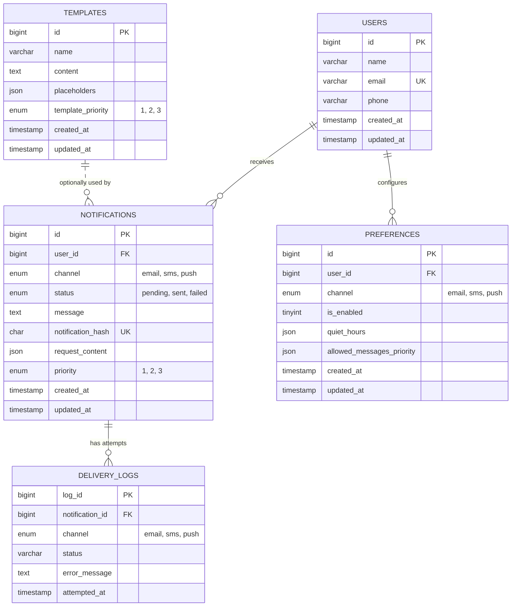

# Notification Engine

A multi-channel notification delivery system built with **Spring Boot** and **Apache Kafka**, capable of sending notifications over **Email, SMS, WhatsApp, and Push** — with priority-based routing, per-user preferences (including quiet hours), template-driven messaging, idempotency guarantees, automatic retries with dead-letter handling, and full observability (metrics, logs, and distributed tracing).

This isn't a single monolith — it's six independently deployable Spring Boot services that together form an event-driven pipeline, closely mirroring how notification platforms are built in production (think: what powers OTPs, transactional alerts, and marketing pings at scale).

---

## Table of Contents
- [Why This Project Exists](#why-this-project-exists)
- [Tech Stack](#tech-stack)
- [System Architecture](#system-architecture)
- [How a Notification Actually Travels](#how-a-notification-actually-travels)
- [Kafka Topic Design](#kafka-topic-design)
- [Reliability & Fault Tolerance](#reliability--fault-tolerance)
- [Observability](#observability)
- [Database Design (ERD)](#database-design-erd)
- [API Surface](#api-surface)
- [Running Locally](#running-locally)
- [Proof of Delivery — All 4 Channels](#proof-of-delivery--all-4-channels)

---

## Why This Project Exists

Sending a notification sounds simple — until you need to send **millions** of them, across **multiple channels**, without spamming users who've opted out, without duplicating messages on retry, and without one slow vendor (say, an email provider having an outage) blocking urgent OTP SMS's from going out.

This project solves that by treating notification delivery as an **asynchronous, priority-aware, per-channel pipeline** instead of a single "send now" API call — which is the architecture real-world systems like AWS SNS, Twilio Notify, or an internal fintech alerting stack actually use.

---

## Tech Stack

| Layer | Technology |
|---|---|
| Language / Framework | Java 17, Spring Boot 3.4 |
| Messaging Backbone | Apache Kafka (KRaft mode — no ZooKeeper), Confluent Control Center for monitoring |
| Persistence | MySQL 8 (via Spring Data JPA / Hibernate) |
| Caching | Redis (template-priority lookup + user cache) |
| Resilience | Resilience4j (Circuit Breaker + Retry), Spring Kafka `@RetryableTopic` + DLT |
| Observability | Spring Boot Actuator + Micrometer (`/actuator/prometheus`), Prometheus (metrics scraping), Grafana (dashboards), Loki (centralized log aggregation via `loki-logback-appender`), Kafka Exporter (broker/topic metrics), correlation-ID based distributed tracing propagated through Kafka headers |
| Email Provider | SendGrid |
| SMS / WhatsApp Provider | Twilio (WhatsApp Business API — one media attachment per message, per Twilio/WhatsApp limits) |
| Push Provider | Firebase Cloud Messaging (`firebase-admin`) |
| Containerization | Docker Compose (MySQL, Redis, Kafka broker, Control Center, Prometheus, Grafana, Loki, Kafka Exporter) |
| API Testing | Postman collection included in repo (v2.0) |

---

## System Architecture

The system is composed of **6 services**, each with a single, well-defined responsibility:

1. **`notificationservice`** — the public-facing API gateway. Accepts send requests, validates them, assigns a priority, and hands off to Kafka. Also owns Users, Templates, and Preferences CRUD. A `CorrelationIdFilter` stamps every inbound request with a correlation ID (via MDC) so its lifecycle can be traced end-to-end across every downstream service.
2. **`NotificationProcessor`** — the brain. Consumes priority-tagged requests, resolves templates, checks user preferences/quiet-hours, de-duplicates, persists to the DB, and fans the request out to per-channel Kafka topics. This service is **deployed multiple times** — once per priority level (`NOTIFICATION_PRIORITY=1|2|3`) — so a flood of low-priority marketing messages can never starve high-priority OTPs of processing capacity.
3. **`EmailConsumer`**, **`SMSConsumer`**, **`WhatsappConsumer`**, **`PushNConsumer`** — four independent microservices, one per channel, each consuming from its own Kafka topic and calling the relevant third-party vendor API (SendGrid / Twilio / Twilio WhatsApp / FCM), wrapped in a circuit breaker + retry policy, with dead-letter handling on exhausted retries.

The correlation ID generated at the gateway is propagated as a Kafka message header through every hop of the pipeline, so a single notification's journey — from the initial API call, through priority routing, channel fan-out, and final vendor delivery — can be reconstructed from logs across all six services.

### Basic Overview Diagram


### Advanced Overview Diagram


**Why this shape?**
- **Two Kafka hops instead of one** (priority topics → channel topics) decouples *"how urgent is this?"* from *"which channel does it go on?"* — a processor doesn't need to know anything about SendGrid vs Twilio, and a channel consumer doesn't need to know anything about priority queuing.
- **Independent scaling.** If WhatsApp delivery is slow today, you scale up `WhatsappConsumer` alone — Email and SMS are untouched.
- **Independent failure domains.** SendGrid having an outage doesn't touch SMS or Push. Resilience4j's circuit breaker trips per-vendor, not globally.

---

## How a Notification Actually Travels

1. A client calls `POST /api/send-notification` on `notificationservice` with a recipient, one or more channels, and either a raw message or a template name + placeholders.
2. The gateway validates the payload, and if no explicit priority was given, looks up the **template's priority** (checking Redis first, falling back to MySQL and populating the cache) — so, for example, an OTP template can be pre-configured as priority `1` (urgent) while a "trending nearby" promo is priority `3` (low).
3. The full request is serialized and pushed onto `priority-1`, `priority-2`, or `priority-3` on Kafka, carrying the request's correlation ID as a header. The API returns `202 Accepted` immediately — the caller doesn't wait for actual delivery.
4. A `NotificationProcessor` instance dedicated to that priority level picks it up. It:
   - Resolves the template into a final message (if templated),
   - Looks up the user's **preferences** — is this channel enabled for them? Are we inside their configured **quiet hours**? Is this message's priority in their `allowed_messages_priority` list?
   - Computes a **content hash** and attempts to persist a `notifications` row — the `(user_id, channel, notification_hash)` unique constraint in MySQL is what actually enforces idempotency; a retried/duplicate request fails to insert and is safely dropped.
   - Publishes the resolved, per-channel payload onto `email-topic`, `sms-topic`, `whatsapp-topic`, or `push-n-topic` (headers, including the correlation ID, carried along), and writes a `delivery_logs` row marking it `pending`.
5. The relevant channel consumer (e.g. `EmailConsumer`) picks the message off its topic, calls the vendor SDK through a Resilience4j-wrapped client, and updates the notification's status in MySQL based on the outcome. For WhatsApp specifically, any media attachment on the request is capped to a single item per message, since the WhatsApp Business API only allows one attachment per outbound message. If the vendor call keeps failing, Spring Kafka's retry topic mechanism retries with backoff before routing the message to a **dead-letter topic**, where the notification is finally marked `failed`.

---

## Kafka Topic Design

| Topic | Producer | Consumer | Purpose |
|---|---|---|---|
| `priority-1` / `priority-2` / `priority-3` | `notificationservice` | `NotificationProcessor` (one deployment per priority) | Route requests by urgency so low-priority traffic can't delay high-priority traffic |
| `email-topic`, `sms-topic`, `whatsapp-topic`, `push-n-topic` | `NotificationProcessor` | corresponding `*Consumer` service | Fan-out by delivery channel; each channel scales and fails independently |
| `<topic>-retry-N` / DLT | Spring Kafka retry mechanism | Same consumer, then a dead-letter handler | Automatic backoff retries (4 attempts, exponential backoff) before permanently marking a notification `failed` |

A **custom Kafka partitioner** in `NotificationProcessor` also maps priority → partition index on the channel topics, so even within, say, `email-topic`, priority-1 traffic is isolated from priority-3 traffic at the partition level — and the consumer side adds a light throttling check so a flood of low-priority messages yields to any in-flight high-priority ones. Every message on every topic carries the originating correlation ID as a Kafka header, which each consumer restores into its own MDC context for traceable logging.

---

## Reliability & Fault Tolerance

- **Circuit Breaker + Retry (Resilience4j)** wraps every outbound vendor call (SendGrid, Twilio, Twilio WhatsApp, FCM) — configurable sliding window, failure threshold, and half-open probe counts per vendor.
- **Retryable topics + Dead Letter Topic (DLT)** at the Kafka consumer layer — transient failures (a vendor blip) get retried automatically with exponential backoff; permanent failures get parked in a DLT and the notification is marked `failed` with the error message logged.
- **Idempotency by design** — the `notifications.notification_hash` unique constraint means the same logical request, even if re-published to Kafka, is only ever delivered once.
- **Preference & quiet-hours enforcement** happens *before* a message ever reaches a channel topic, so opted-out users or messages sent during a user's configured quiet window never even reach the vendor.
- **End-to-end correlation IDs** mean that when something does fail, the exact failing request can be traced through every service's logs (and in Grafana/Loki) instead of being pieced together from timestamps.

---

## Observability

Every service exposes Actuator health and Prometheus-formatted metrics (`/actuator/prometheus`) via Micrometer, and ships structured logs to Loki through `loki-logback-appender` — all tagged with `spring.application.name` and the request's correlation ID.

- **Prometheus** scrapes each of the six services (gateway, per-priority processors, and the four channel consumers) plus a dedicated **Kafka Exporter** for broker/topic-level metrics (consumer lag, partition throughput, etc.).
- **Grafana** visualizes it all on a pre-built dashboard (`grafana_notification_engine_dashboard.json`,`grafana_notification_engine_logs_dashboard.json`) covering request rates, delivery success/failure by channel, circuit breaker state, and Kafka consumer lag.
- **Loki** centralizes logs from all six services so a single correlation ID can be searched to pull the full trace of one notification's journey, end to end.

This turns "did the OTP actually go out, and if not, where did it die?" from a multi-service log-grepping exercise into a single dashboard query.

### Some Grafana Dashboard Images


---

## Database Design (ERD)

MySQL is the system of record for users, their channel preferences, reusable message templates, every notification that's been requested, and a full delivery audit trail.



**Table-by-table:**

- **`users`** — the recipient directory. `email` is unique and doubles as the natural key used by `/api/v1/users/sync` to find-or-create a profile.
- **`preferences`** — one row per `(user, channel)`. Holds the opt-in flag, a `quiet_hours` JSON window (start/end + an enabled flag), and an `allowed_messages_priority` JSON array — so a user can, for instance, allow only priority `3` (low-urgency) push notifications while allowing all priorities over email.
- **`templates`** — reusable message bodies with `{placeholder}` tokens, a required-placeholders list, and a `template_priority` that the gateway uses to auto-assign urgency when the caller doesn't specify one explicitly.
- **`notifications`** — one row per notification *attempt at the request level*, storing the resolved message, the full original request as JSON, and a `notification_hash` that's the actual idempotency guard (unique per `user_id + channel + hash`).
- **`delivery_logs`** — an append-only audit trail; every time a notification is scheduled to Kafka, retried, or fails permanently, a log row is written, so you can reconstruct the full lifecycle of any single notification.

---

## API Surface

Exposed by `notificationservice` (full request/response shapes are in the included Postman collection):

| Method | Endpoint | Purpose |
|---|---|---|
| `GET` | `/api/health` | Liveness check |
| `POST` | `/api/send-notification` | Queue a notification (raw message or template-based) across one or more channels |
| `POST` | `/api/v1/users/sync` | Create or find a user by email |
| `PUT` | `/api/v1/users/update` | Update a user's profile / FCM token |
| `PUT` | `/api/v1/users/{userId}/preferences` | Update channel preferences (enable/disable, quiet hours, allowed priorities) |
| `POST` | `/api/v1/templates` | Create a message template |
| `GET` | `/api/v1/templates` / `/api/v1/templates/{id}` | List / fetch templates |
| `PUT` | `/api/v1/templates/{id}` | Update a template |
| `DELETE` | `/api/v1/templates/{id}` | Delete a template |

Each service also exposes `/actuator/health` and `/actuator/prometheus` for liveness and metrics scraping.

---

## Running Locally

```bash
# 1. Spin up infra: MySQL, Redis, Kafka (KRaft), Control Center, Prometheus, Grafana, Loki, Kafka Exporter
docker-compose up -d

# 2. Load the schema + seed data
mysql -h 127.0.0.1 -P 3306 -u root -p notification_engine < notification_engine.sql

# 3. Run each service (repeat with NOTIFICATION_PRIORITY=1, 2, 3 for NotificationProcessor)
cd notificationservice && ./mvnw spring-boot:run
cd NotificationProcessor && NOTIFICATION_PRIORITY=1 ./mvnw spring-boot:run
cd EmailConsumer && ./mvnw spring-boot:run
cd SMSConsumer && ./mvnw spring-boot:run
cd WhatsappConsumer && ./mvnw spring-boot:run
cd PushNConsumer && ./mvnw spring-boot:run
```

Each service reads its DB, Redis, Kafka, and vendor credentials from environment variables (see each module's `application.properties`) — sensible `localhost` defaults are provided for local development, so you only need to supply the third-party API keys (SendGrid, Twilio, Firebase) to actually deliver messages.

Local endpoints once everything is up:

| Tool | URL | Purpose |
|---|---|---|
| Confluent Control Center | `http://localhost:9021` | Inspect Kafka topics, partitions, and consumer groups visually |
| Prometheus | `http://localhost:9090` | Query raw metrics scraped from all six services + Kafka Exporter |
| Grafana | `http://localhost:3000` | Pre-built dashboard (import `grafana_notification_engine_dashboard.json`); default login `admin` / `admin` |
| Loki (via Grafana) | `http://localhost:3100` | Search centralized logs by correlation ID across all services |

`fcmNotificationTester/` is a small standalone static page (not a Spring Boot module) for registering a browser for Firebase Cloud Messaging and receiving a test push notification — useful for exercising the `PushNConsumer` path without needing a real mobile client. Open `fcmNotificationTester/index.html` with your own Firebase web config to use it.

---

## Proof of Delivery — All 4 Channels

> **Attach screenshots below** — one proof image per channel showing a successfully delivered notification (e.g. the received email, SMS, WhatsApp message, and push notification).

### WhatsApp Notification


### Email Notification


### SMS Notification


### PUSH Notification
